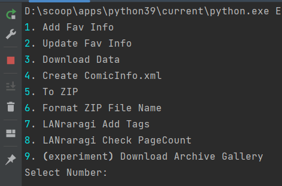

# EhFavDL

[](https://www.python.org/)
[](https://github.com/eezd/EhFavDL/releases)
[](https://github.com/eezd/EhFavDL)
[](https://github.com/eezd/EhFavDL)
[](https://github.com/eezd/EhFavDL/commits/main)
[](LICENSE)

E-Hentai / Exhentai 下载收藏夹，基于 Python3.11 编，支持 Komga 和 LANraragi。

[中文](README.md)/[English](README-EN.md)


## 📌 TODO

以下是英文的合理润色翻译：

- [x] Support `Sqlite` storage.
- [x] Automatically retry downloads on failure.
- [x] Generate `ComicInfo.xml` (support Komga/LANraragi).
- [x] Compress into zip compatible with Komga/LANraragi.
- [x] Add EH Tags for LANraragi.
- [x] Support downloading original images or archived downloads.载





## 🔨 Installation

> ✏️ If you are using PyCharm, please enable "Emulate terminal in output console" in your run/debug configuration to view styled output.
> ✏️ If you are using PyCharm, please enable "Emulate terminal in output console" in your run/debug configuration to view styled output.
> ✏️ If you are using PyCharm, please enable "Emulate terminal in output console" in your run/debug configuration to view styled output.


- 1、Install Environment

```bash
pip install -r requirements.txt
```


- 2、Fill in `config.yaml`

```yaml
cookies:
  ipb_member_id: 
  ipb_pass_hash: 
  igneous: 

User-Agent: Mozilla/5.0 (Windows NT 10.0; Win64; x64) AppleWebKit/537.36 (KHTML, like Gecko) Chrome/112.0.0.0 Safari/537.36

proxy:
  enable: True
  url: http://127.0.0.1:7890

dbs_name: ./data.db

work_path: E:\Code\EhFavDL

data_path: E:\Code\EhFavDL\data

website: exhentai.org

connect_limit: 3

lan_url: http://127.0.0.1:7070

# Setting >>> Security >>> API Key
lan_api_psw: my-api-psw
```


- 3、Execute

```shell
python main.py
```


****


> 🔧 The next part is crucial, please read carefully. 🔧

- 1 `Add Fav Info`
    - **Please execute this on the first run.**
    - Update Fav's data.

- 2 `Update Fav Tags`
    - Using EH API to update Tags

- 3 `Download Data`
    - Download Gallery

- 4 `Create ComicInfo.xml`
    - Based on the folder's starting GID, search the database for matching information, and create ComicInfo.xml in the folder

- 5 `To ZIP`
    - ompressing a Folder into a ZIP File

- 6 `Format ZIP File Name`
    - Please note that in LANraragi, if your file names are too long, it may freeze and give an error. Therefore, you may need to use this feature to format the file names to an appropriate length.

- 7 `LANraragi Add Tags`

- 8 `LANraragi Check PageCount`
    - Comparing the Number of Pages in a Database and Local Files
    - `if db_page_count > loc_page_count & abs(db_page_count - loc_page_count) > 3:`

Q: Why is 9(experiment) Download Archive Gallery using a_status instead of status to mark the status?

A: Because the default way to download galleries is through the web (1280x), I can't mix tags for original and 1280x galleries.

- 9 `(experiment) Download Archive Gallery`
    - 🏁Attention!! This code retrieves data from the database. Please run 1. Add Fav Info first to ensure your FAV data is up to date.
    - Download original images, and be mindful of your GP points.
    - The status is marked by the a_status field in the FAV table, not the status field.


## Usage Guide

After completing the installation steps above, some users may still be unsure how to proceed. Here's a brief explanation on how to use it, using LANraragi as an example:

- 1) Enter `1` to run `1. Add Fav Info`
  - Obtain FAV data.
- 2) `3. Download Data` OR `9. (experiment) Download Archive Gallery` to download the gallery (.zip) file.
- 3) Manually unzip the `*.zip` file. Once done, manually delete the `*.zip` file
- 4) Run `4. Create ComicInfo.xml`
- 5) Run `5. To ZIP`
- 6) Run `6. Format ZIP File Name`
- 7) Move your files to the corresponding data folder in LANraragi.
- 8) Open your browser and navigate to `LANraragi-Settings`:
    - Set `Security---Enable Password` to `ON`
    - Set `Security---API Key` to `API PSW` (corresponding to the `lan_api_psw` field in the `config.yaml` file)
    - ` Archive Files---Rescan Archive Directory` and wait for completion.
- 9) Run `7. LANraragi Add Tags` to start using it normally


****


- Best practice: You can now use the 'Favorites' feature of `eh` to categorize galleries, starting from version `>=1.1.2`.


## 💡 Komga or LANraragi ？

- `Komga`
    - 1、May experience lag when dealing with a large number of files (e.g., 1000 files locally).
    - 2、TAG can only be one line, not multiple TAGs like EH.


> WARNING!!
>
> LANraragi：当文件名过长可能会无法读取

- `LANraragi`
    - 1、Does not experience lag when dealing with a large number of files like Komga.
    - 2、TAGs are similar to EH.


