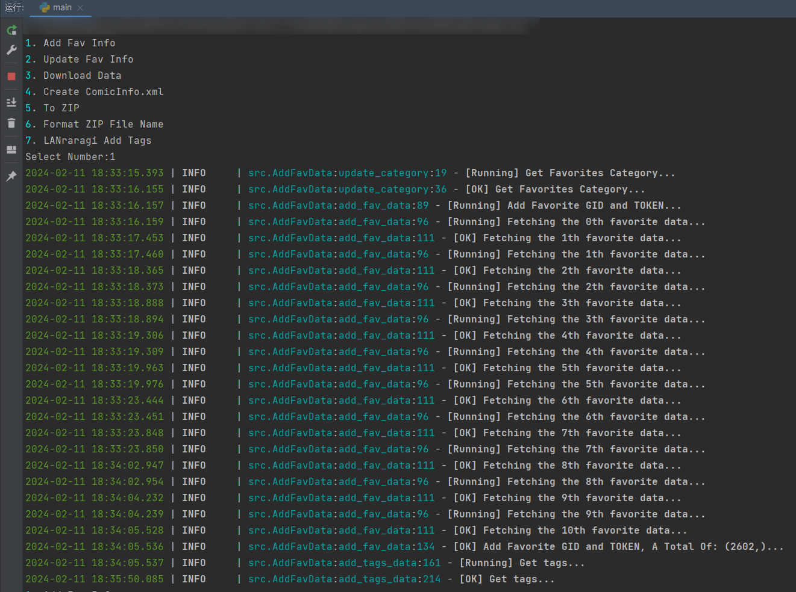
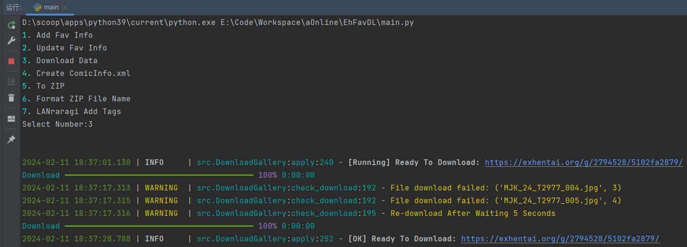
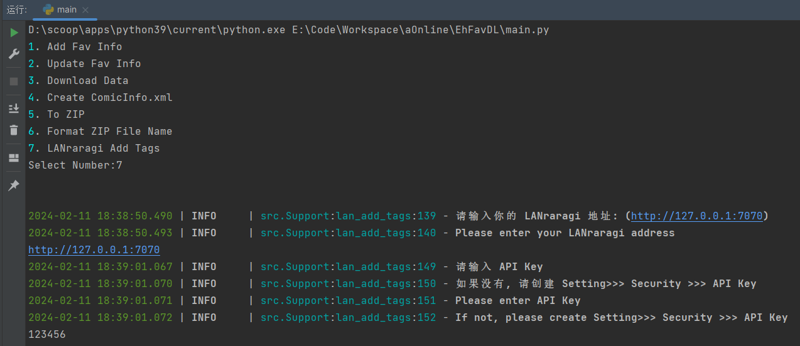
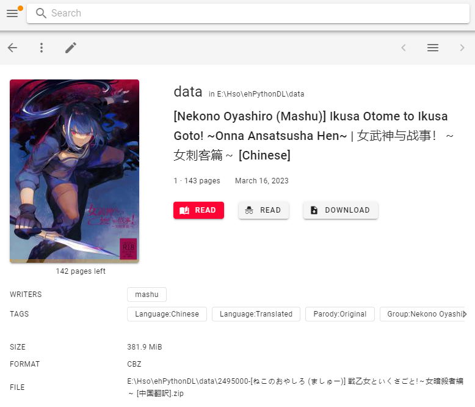
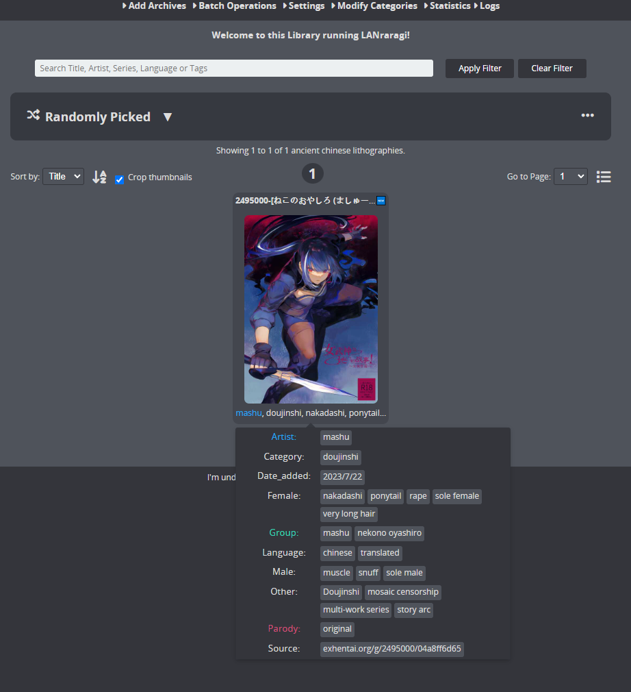

# EhFavDL

[](https://www.python.org/)
[](https://github.com/eezd/EhFavDL/releases)
[](https://github.com/eezd/EhFavDL)
[](https://github.com/eezd/EhFavDL)
[](https://github.com/eezd/EhFavDL/commits/main)
[](LICENSE)

Download favorites from E-Hentai/Exhentai, based on Python 3.9, supporting Komga and LANraragi.

[中文](README.md)/[English](README-EN.md)

## 📌 TODO

- [x] Support `Sqlite` storage
- [x] Automatically retry download in case of failure
- [x] Generate `ComicInfo.xml` (compatible with Komga/LANraragi)
- [x] Compress into zip format for compatibility with Komga/LANraragi
- [x] Add EH Tags to LANraragi







## 🔨 Usage

> If you are using PyCharm, enable "emulate terminal" in the output console option in run/debug configuration to see styled output.

- 1. Install dependencies

```bash
pip install -r requirements.txt
```

- 2. Fill in `config.yaml`

```yaml
cookies:
  ipb_member_id:
  ipb_pass_hash:
  igneous:

User-Agent: Mozilla/5.0 (Windows NT 10.0; Win64; x64) AppleWebKit/537.36 (KHTML, like Gecko) Chrome/112.0.0.0 Safari/537.36

proxy:
  enable: True
  url: http://127.0.0.1:7890

dbs_name: ./data.db

work_path: E:\Code\EhFavDL

data_path: E:\Code\EhFavDL\data

website: exhentai.org

connect_limit: 3

lan_url: http://127.0.0.1:7070

# Setting >>> Security >>> API Key
lan_api_psw: my-api-psw
```

- 3. Run

```bash
python main.py
```

> 🔧 The next part is crucial, please read it carefully. 🔧

1. `Add Fav Info`

**Execute this for the first run**, note that this method will not update field information (`INSERT OR IGNORE INTO`).

2. `Update Fav Info`

This method will update all field information

3. `Download Data`

Download the gallery.

4. `Create ComicInfo.xml`

Based on the GID at the beginning of the folder, search the database for matching information, and create `ComicInfo.xml` in the folder.

5. `To ZIP`

Compress the folder into a ZIP file.

6. `Format ZIP File Name`

Note that in `LANraragi`, if your file name is too long, it may freeze and throw an error. Use this feature to format the file name length.

7. `LANraragi Add Tags`

Refer to the images above.

8. `LANraragi Check PageCount`

Compare the page numbers between the database and local files.

```python
if db_page_count > loc_page_count & abs(db_page_count - loc_page_count) > 3:
```


## 💡 Komga or LANraragi?

- `Komga`
  - 1. May experience lag when dealing with a large number of files (e.g., 1000 files locally).
  - 2. TAG can only be one line, not multiple TAGs like EH.



> WARNING!!
>
> LANraragi: May not be able to read if the file name is too long.

- `LANraragi`
  - 1. Does not experience lag when dealing with a large number of files like `Komga`.
  - 2. TAGs are similar to EH.


